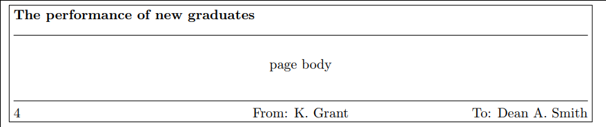

# Introdução ao LaTeX para o SciELO

- Quem eu sou
- Conteúdo do curso
- Público-alvo
- Para quem é o LaTeX?
- Quem usa LaTeX?
- Objetivos

## Conteúdo

1. [História e filosofia](#história-e-filosofia)
2. [LaTeX: uma linguagem de marcação](#latex-uma-linguagem-de-marcação)
3. [Exemplo: um artigo](#exemplo-um-artigo)
4. [Comandos do LaTeX](#comandos-do-latex)
5. [Símbolos especiais](#símbolos-especiais)
6. [Preâmbulo do documento](#preâmbulo-do-documento)
7. [O corpo do documento](#o-corpo-do-documento)
8. [Pacotes](#pacotes)
9. [Fontes](#fontes)
10. [Layouts de página](#layouts-de-página)
11. [Posição do texto](#posição-do-texto)
12. [Listas](#listas)
13. [Tabelas e tabulares](#tabelas-e-tabulares)
14. [Imagens](#imagens)
15. [Matemática](#matemática)
16. [A classe `abntex2`](#a-classe-abntex2)
17. [Bibliografias](#bibliografias)
18. [Macros](#macros)
19. [Pacotes úteis](#pacotes-úteis)
20. [Escrevendo classes](#escrevendo-classes)
21. [Conversão de XML para LaTeX](#conversão-de-xml-para-latex)
22. [Referências](#referências)

## História e filosofia

- Donald Knuth nasceu em Milwaukee, Wisconsin, em 1938.
- Seu pai tinha uma pequena editora, por isso conhecia as tradições da
  tipografia.
- Na Caltech, foi contratado como professor associado. Começou a escrever um
  livro sobre compiladores, mas logo notou que o escopo da obra seria muito
  maior. Planejou um livro de doze capítulos que seria chamado *The Art of
  Computer Programming*.
- 1977: segunda edição do segundo volume do *TAoCP* não agradou Knuth
- ASCII não foi projetado para publicar livros
- Pelos próximos 10 anos, ele trabalha no TeX
- TeX: tau epsilon chi
- [TeXBook](http://www.ctex.org/documents/shredder/src/texbook.pdf)
- Leslie Lamport criou uma série de macros para usar o TeX, conhecidas como
  LaTeX.

## LaTeX: uma linguagem de marcação

Assim como HTML, XML ou Markdown, o LaTeX é uma linguagem de *markup* (marcação
de texto). Em outras palavras, o usuário instrui o computador sobre como o
texto deve ser formatado e o programa segue as instruções. Ao contrário das
linguagens anteriores, o LaTeX é mais *semântico*. Por exemplo, o que os
comandos a seguir devem fazer?

```latex
\tableofcontents
\section{Introdução}
```

Muito embora você talvez nunca tenha visto um comando em LaTeX, fica claro que
o primeiro insere o sumário e o segundo indica o começo da seção “Introdução”.
Logo veremos como esses comandos geram elementos visuais. Como se pode ver, os
arquivos-fonte `.tex` não são textos formatados, mas arquivos em texto plano.
Isso meramente significa que o arquivo contém apenas os 95 caracteres ASCII
imprimíveis (UTF-8 também está se tornando lugar comum).

## Exemplo: um artigo

Para entender como comandos se transformam no produto final, abriremos nosso
primeiro arquivo `.tex`, localizado em [`exemplos/artigo.tex`](exemplos/artigo.tex).

Nesse arquivo, veremos:

- Estrutura e capacidades de um documento LaTeX
- Compilação usando `lualatex` (e `pdflatex`)
- Comandos: `\section, \LaTeX, \tableofcontents, \url`
- Classes: `article`, `minimal` e seu efeito em `\section`
- Erros de compilação
- Arquivos auxiliares e o comando `latexmk -c`

## Comandos do LaTeX

Comandos simples, como `\tableofcontents`, devem estar separados do texto por
espaço em branco. Por exemplo:

```latex
\tableofcontents Embora isso funcione, o próximo exemplo ganha mais pontos por
estilo e ajuda na leitura do código. Por quê?
```

```latex
\tableofcontents
Esse exemplo é melhor, mas como espaço em branco não faz diferença, talvez
valesse a pena colocar mais uma linha entre o parágrafo e o comando.
```

Há, também, comandos que aceitam argumentos, como `\section{Introdução}`.
Argumentos sempre ficam entre `{ chaves }`:

```latex
\section{Introdução}\label{introducao}Este exemplo funciona, mas o código não é
muito legível. O resultado será perfeito, entretanto.
```

### Exemplo

Vamos voltar ao arquivo [`exemplos/artigo.tex`](exemplos/artigo.tex) para
aprender na prática sobre esses comandos.

### Espaço em branco

Em LaTeX, múltiplos espaços em branco (espaços, TABs, novas linhas) são
condensados para apenas *um* espaço em branco. Assim, o exemplo a seguir terá o
mesmo efeito do anterior:

```latex
\section      {Introdução}
        \label{introducao}

        Este exemplo funciona, mas o código não é
muito legível.      O resultado será perfeito, entretanto.
```

#### Exemplo e exercício

Voltemos a [`exemplos/artigo.tex`](exemplos/artigo.tex) para aprender mais
sobre espaços em branco e como usá-lo para tornar o código mais legível.

Agora, vamos a [`exercicios/espaco-branco.tex`](exercicios/espaco-branco.tex) e
resolver o problema proposto nos comentários. Quando o arquivo for compilado a
primeira vez, haverá um problema de hifenização. Por quê?

## Símbolos especiais

### Aspas

Em LaTeX, não usamos as chamadas “aspas burras” (`""`):

```latex
``Devemos abrir aspas com dois acentos graves e fechar com duas aspas
simples.''
```

### Hífen, travessão e a meia-risca

Existe uma diferença entre o hífen, o travessão e a meia-risca:

```latex
Leve um guarda-chuva --- ouvi na rádio que pode chover entre 10h--13h.
```

### Espaços não quebráveis

Às vezes, é necessário que um espaço não se quebre ao fim de uma linha, por
exemplo:

```latex
Às 10~horas de ontem…
Fui à casa do Sr.~Silva…
Veja mais na página~40.
```

### Caracteres reservados

Como veremos no decorrer de nosso curso, os símbolos a seguir estão reservados
para o uso do LaTeX:

```latex
# $ % ^ & _ { } ~ \
```

Devemos escapá-los para que sejam impresso da maneira correta:

```latex
\# \$ \% \^{} \& \_ \{ \} \~{} \textbackslash
```

### Exercício

[`exercicios/caracteres-reservados.tex`](exercicios/caracteres-reservados.tex)
não escapa os símbolos acima. Corrija o problema e compile o arquivo
corretamente.

## Preâmbulo do documento

Voltaremos ao documento [`exemplos/artigo.tex`](exemplos/artigo.tex) novamente,
para aprender mais sobre classes de documento.

Documentos LaTeX são divididos em duas partes: o *preâmbulo* e o documento em
si, que fica entre `\begin{document}` e `\end{document}`. No preâmbulo de
`artigo.tex`, a primeira linha que nos chama a atenção é:

```latex
\documentclass[11pt,a4paper,oneside]{article}
```
Anteriormente discutimos duas classes LaTeX: `article` e `minimal`. A
distribuição vem, no entanto, com mais classes por padrão. Por exemplo:

- `article`: para escrever artigos
- `report`: para escrever relatórios
- `book`: para livros
- `letter`: para redigir cartas
- `memoir`: baseada na classe book, traz vários comandos úteis
- `beamer`: para apresentações de slide

O que são essas palavras entre os dois colchetes? São algumas das opções que a
classe `article` nos oferece. Aqui estão as opções de classe mais comuns:

- `10pt, 11pt, 12pt`
- `a4paper, letterpaper, ...`
- `fleqn`: equações são alinhadas à esquerda ao invés de seres centralizadas.
- `leqno`: a numeração das equações fica à esquerda ao invés da direita.
- `titlepage, notitlepage`
- `twocolumn`
- `twoside, oneside`: arruma as margens para a impressão nos dois lados do
  papel ou apenas um.
- `landscape`: o documento é impresso em formato paisagem.
- `openright, openany`: não funciona com a classe `article`, pois ela não
  fornece o comando `chapter`.
- `draft`: indica problemas de hifenização e justificação imprimindo um pequeno
  quadrado na margem direita. Também suprime a colocação das imagens, colocando
  um quadro em branco em seu lugar. O tempo de compilação é bem menor.

Ressaltamos que as classes padrão (`article`, `report`, `book` e `letter`) não
foram escritas para serem usadas em produção e devem ser ajustadas para
resultados mais profissionais.

Além disso, no preâmbulo também carregamos os *pacotes*, como veremos a seguir.

### Exemplo

Vamos abrir [`exemplos/artigo.tex`](exemplos/artigo.tex) para testar as classes
e opções acima. Veremos também os comandos `\title`, `\author` e `\date`.

## O corpo do documento

Enquanto que o preâmbulo contém a declaração do tipo de documento, carrega os
pacotes e configura algumas opções (como veremos a seguir), o corpo do
documento contém o texto, dividido ou não em partes, capítulos, seções e
parágrafos.

O corpo do documento é delimitado por:

```latex
\begin{document}
…
\end{document}
```

Neste *ambiente* que criamos, podemos estruturar nosso documento usando os
comandos a seguir (os números são a *profundidade* a subdivisão):

- `\part`: -1
- `\chapter`: 0 (apenas `book` e `report`)
- `\section`: 1
- `\subsection`: 2
- `\subsubsection`: 3
- `\paragraph`: 4
- `\subparagraph`: 5

Nenhum dos comandos de secionamento está disponível na classe `letter`.

O valor de *profundidade* é usado internamente pelo LaTeX. Na classe `article`,
por exemplo, o contador `secnumdepth`, que define qual a parte mais profunda a
ser numerada, é configurado para o valor `3`. Ou seja, `\paragraph` e
`\subparagraph` não são numerados. É possível mudar esse comportamento com os
comandos a seguir, que devem ir no preâmbulo:

```latex
\setcounter{secnumdepth}{1}
```
Também é possível controlar o que será incluído no sumário com o comando:

```latex
\setcounter{tocdepth}{2}
```

Alternativamente, os comandos acima possuem uma versão estrelada (`\section*`),
que produz uma versão não numerada e que não aparece no sumário.

Às vezes, o título de uma seção ou capítulo pode ser longo demais para o
sumário. Por isso, é possível usar a seguinte sintaxe para controlar o nome que
aparecerá no sumário:

```latex
\section[Seção muito longa]{Seção muito longa: provavelmente não ficará muito
boa no sumário}
```

Parágrafos são criados deixando uma linha em branca entre eles. Entretanto,
essa linha em branca apenas indica ao LaTeX o começo de um parágrafo novo e
*não significa que uma linha em branco será impressa no documento*. O
espaçamento entre parágrafos é controlado pelo valor de `\parskip`:

```latex
\setlength{\parskip}{1cm} % espaçamento fixo
\setlength{\parskip}{1cm plus4mm minus3mm} % espaçamento variável
```

Finalmente, parágrafos que ocorrem imediatamente após uma subdivisão do
documento não são indentados, por motivos de tradição tipográfica. No entanto,
esse comportamento pode ser modificado carregando o pacote `indentfirst`.

### Exemplo e exercício

Vejamos esses conceitos demonstrados, mais uma vez, em
[`exemplos/artigo.tex`](exemplos/artigo.tex).

De posse desses conhecimentos sobre como documentos LaTeX são estruturados e o
que deve ir no preâmbulo e no corpo do documento, vamos resolver
[`exercicios/meu-artigo.tex`](exercicios/meu-artigo.tex).

## Pacotes

Em alguns exercícios, vimos que a hifenização estava errada. Por padrão, o
LaTeX é configurado para hifenizar de acordo com a língua inglesa. Para
resolver esse problema, devemos carregar nosso primeiro *pacote*.

Existem várias coisas que não são possíveis com o LaTeX básico — ao menos não
trivialmente — mas durante sua vida como usuário desse sistema você descobrirá
dezenas de pacotes muito úteis, que tornam tarefas tediosas e difíceis muito
mais agradáveis de resolver. Para carregar um pacote, usamos a seguinte sintaxe
no *preâmbulo* do nosso arquivo:

```latex
\usepackage[opções]{pacote}
```

Para resolver o problema da localização do nosso arquivo, utilizaremos o pacote
`polyglossia`:

```latex
\usepackage{polyglossia}
  \setdefaultlanguage{brazil}
  \setotherlanguage{english}
```

Algumas das capacidades do `polyglossia` são:

- Ajustar datas de acordo com a língua
- Ajustar convenções tipográficas para a língua escolhida
- Hifenização
- Strings do documento (como em `\today`)

### Exercício

Em [`exercicios/pacotes.tex`](exercicios/pacotes.tex), treinaremos como
carregar pacotes.

### Documentação no CTAN

O [CTAN](https://ctan.org) é o repositório de pacotes e documentação do LaTeX.
Antes de resolver alguma tarefa manualmente, é uma boa ideia conferir se alguém
já não resolveu o problema com um pacote. Além disso, é possível encontrar a
documentação de todos os pacotes lá. Vejamos [a documentação do
`polyglossia`](https://www.ctan.org/pkg/polyglossia), por exemplo.

## Fontes

Anteriormente, arquivos LateX compilados usando o programa `pdflatex` não
podiam usar qualquer fonte. Existem catálogos de fontes suportadas por esse
programa, como por exemplo [The LaTeX Font
Catalogue](http://www.tug.dk/FontCatalogue/). Atualmente, no entanto, é
possível usar o `lualatex` ou ainda o `xelatex`, que oferecem suporte aos
formatos de fonte mais comuns.

Para isso, devemos carregar o pacote `fontspec`:

```latex
\usepackage{fontspec}
  \setmainfont{Times New Roman}
```

### Itálicos, negritos e outros tipos

Fontes geralmente vêm em famílias que contém diversos tipos: romanas maiúsculas
e minúsculas, itálicos, negritos e versaletes, além dos algorismos de título e
texto. A fonte usada por padrão no LaTeX, chamada de Computer Modern e
projetada pelo próprio Knuth, é bastante completa nesse respeito. Para acessar
esses tipos, temos os comandos a seguir à nossa disposição.

- `\emph{}`: itálico quando em texto romano, romando quando em texto itálico
- `\textbf{}`: negrito
- `\textsc{}`: versaletes (em inglês: *small caps*)
- `\texttt{}`: fonte de teletipo

### Tamanhos

Assim como diferentes tipos carregam diferentes significados, os tamanhos das
fontes também devem revelar alguma intenção semântica, alguma relação entre si:
uma escala.

O LaTeX leva essas questões em consideração automaticamente quando usamos
comandos como `\section`, por exemplo. Nós também podemos acessar esses
tamanhos utilizando os seguintes comandos:

- `\tiny`: 5pt
- `\scriptsize`: 7pt
- `\footnotesize`: 8pt
- `\small`: 9pt
- `\normalsize`: 10pt
- `\large`: 12pt
- `\Large`: 14pt
- `\LARGE`: 17pt
- `\huge`: 20pt
- `\Huge`: 25pt

Tenha em mente que os valores acima valem apenas para as classes quem vem por
padrão no LaTeX e quando o valor de `normalsize` é igual a 10pt. Outras classes
podem trazer outros valores, de acordo com a decisão de seu designer. Além
disso, é importante dizer que o tamanho do ponto no TeX é diferente do tamanho
usado atualmente pela maior parte dos programas. Quando Knuth projetou o
sistema, a editoração digital não era comum e muito menos acessível. Durante a
infância em Milwaukee, Wisconsin, seu pai era dono de uma editora. Assim, Knuth
cresceu dentro da tradição anglo-saxã de tipografia, que define um ponto como
0.35145980 mm. No entanto, com o advento do PostScript da Adobe, o ponto foi
redefinido para 0.3527 mm (1/72 in).

### Selecionar fontes diferentes

Uma das maiores vantagens de utilizar o `fontspec`, como vimos acima, é o fácil
acesso à de seleção de fontes. Antigamente, era necessário carregar um pacote
que implementasse a fonte desejada em MetaFont. Hoje, é possível usar arquivos
`ttf` e `otf`.

Para selecionar uma fonte instalada no sistema nos diretórios padrões, basta
usar o comando:

```latex
\setmainfont{Linux Libertine}
```

Caso você esteja trabalhando com um dos editores online de LaTeX, é possível
fazer o upload das fontes para o serviço e especificar o caminho. Por exemplo:

```latex
\setmainfont{Linux Libertine}[
  Path = fonts/
]
```

Uma funcionalidade muitas vezes ignorada sobre as fontes são as ligaduras. Elas
acontecem em sequências de caracteres que colidem naturalmente e são uma
tradição tipográfica muito antiga, que ganhamos de graça usando o LaTeX.

### Exemplo e exercício

Vejamos o exemplos em [`exemplos/fontes.tex`](exemplos/fontes.tex) e depois,
vamos resolver
[`exercicios/sonhos-noites-verao.tex`](exercicios/sonhos-noites-verao.tex).

## Layouts de página

Usando a solução do exercício anterior, vamos mudar a opção de classe
`onecolumn` para `twocolumn` e visualizar o efeito dessa mudança no layout da
página. Também carregaremos o pacote `showframe`. As enormes margens parecem
uma perda de papel — e são —, mas existe um motivo por trás delas: quando lemos
uma linha longa demais, perdemos a noção de onde ela havia começado. O tamanho
de linha ideal fica por volta de 66 caracteres, incluindo espaços.  Esse é o
mesmo motivo pelo qual jornais são divididos em diversas colunas. Para resolver
esse problema das margens, existem algumas soluções:

- Dividir o texto em duas colunas (melhor solução)
- Carregar o pacote `fullpage`
- Carregar o pacote `fullpage` com espaçamento grande entre as linhas

Para arrumar o espaçamento entre as linhas, devemos utilizar o pacote
`setspace`. Ele vem com os seguintes comandos:

- `\singlespacing`
- `\onehalfspacing`
- `\doublespacing`

Quando você utilizar o comando `\onehalfspacing`, por exemplo, o documento
seguirá esse espaçamento até que outro espaçamento seja especificado.

Outro fator que influencia o layout da página é seu estilo. O LaTeX vem com
dois comandos, `\pagestyle{}` e `\thispagestyle{}`, que aceitam os seguintes
argumentos:

- `empty`: sem texto no cabeçalho e no rodapé
- `plain`: cabeçalho limpo, mas o número da página aparece centralizado no
  rodapé
- `headings`: rodapé limpo, informações como o nome da seção e número da página
  aparecem no cabeçalho

Mais à frente, veremos como customizar os cabeçalhos e rodapés usando o pacote
`fancyhdr`.

### Exemplo e exercício

Vejamos alguns exemplos em
[`exemplos/layouts-pagina.tex`](exemplos/layouts-pagina.tex).

Em [`exercicios/certificado.tex`](exercicios/certificado.tex), vamos começar a
escrever um certificado de conclusão do workshop. No momento, não vamos nos
preocupar com a posição exata do texto no papel. Algumas ideias de como
implementar:

- Um certificado em modo de paisagem é muito mais convincente.
- Quais seriam os tamanhos dos diferentes textos? Qual a relação hierárquica
  entre eles? Justifique sua decisão.

(A ideia para este exercício foi tirada do livro *LaTeX Tutorials: a Primer*.)

## Posição do texto

Se quisermos que nosso certificado fique mais parecido com um de verdade,
precisamos aprender a colocar nosso texto nas regiões do papel que desejamos.
Por padrão, as caixas de texto em LaTeX são justificadas, mas há outras opções
comuns como textos centralizados, alinhados à esquerda ou à direita.

Para determinar a posição horizontal do texto, precisamos encontrar nosso
primeiro *ambiente.* Na verdade, um dos primeiros construtos que encontramos em
nossa jornada foi o ambiente `document`, delimitado por dois comandos: `\begin`
e `\end`.

O ambiente `center`, com o nome sugere, se encarrega de centralizar texto na
página:

```latex
\begin{center}
  Este texto será centralizado.
\end{center}
```

De maneira similar, os ambiente `flushleft` e `flushright` alinham texto ao
lado esquerdo e direito do papel, respectivamente.

Além disso, é possível controlar o espaço dentro de uma linha com o comando
`\hspace{comprimento}`, por exemplo:

```latex
Essa frase\hspace{2cm} está esticada.
```

Algumas unidades que o LaTeX reconhece são:

- `mm`
- `cm`
- `in`
- `pt`
- `em` (comprimento da letra “m”)
- `ex` (altura da letra “x”)
- `\textheight` e `\textwidth` (altura e comprimento da corpo do texto)
- `\pageheight` e `\pagewidth` (altura e comprimento da página toda)

Ainda é possível utilizar o comando `\hfill`, que preenche todo o espaço
disponível na linha:

```latex
Começo\hfill meio\hfill fim
```

Finalmente, o espaço vertical entre os parágrafos pode ser controlado da mesma
maneira, com os comandos `\vspace{comprimento}` e `\vfill`.

### Exemplo e exercício

Vejamos mais no exemplo
[`exemplos/posicao-texto.tex`](exemplos/posicao-texto.tex). Depois, vamos
resolver
[`exercicios/certificado-posicionado.tex`](exercicios/certificado-posicionado.tex).

## Listas

O LaTeX vem com três ambientes para descrever listas: `itemize`, `enumerate` e
`description`. Eles permitem a criação de listas itemizadas, enumeradas e de
descrição, respectivamente.

```latex
\begin{itemize}
  \item O ambiente \code{itemize} é geralmente usado para listas cuja ordem
  não é importante.
  \item A numeração que listas do tipo \code{enumerate} trazem pode indicar
  os passos necessários para completar uma tarefa, ou sua ordem de
  importância.
  \item A lista do tipo \code{description} é excelente para explicar
  conceitos relacionados. Que oportunidade perdida de usá-la!
\end{itemize}
```

### Exemplo

Esses conceitos são explorados no arquivo
[`exemplos/listas.tex`](exemplos/listas.tex). Veremos como criar listas dentro
de listas e a sintaxe do ambiente `description`.

### O pacote `enumerate`

Uma maneira muito elegante de customizar listas ordenadas é o pacote
[`enumerate`](https://www.ctan.org/pkg/enumerate). Ele adiciona um argumento
adicional ao ambiente de mesmo nome, permitindo customizar a lista facilmente:

```latex
\begin{itemize}[A)]
  \item Tales de Mileto
  \item Pitágoras
  \item Xenófanes
  \item Empédocles
  \item Aristóteles
\end{itemize}
```

### Exercício

Para treinar, resolveremos o exercício
[`exercicios/receita.tex`](exercicios/receita.tex), editando a lista de
ingredientes para uma receita de panqueca. Entretanto, há um problema: os
contadores resetam quando uma lista é terminada. Podemos criar um novo contador
`\newcounter{ingredients}` e, ao fim da primeira lista, salvar o valor de
`enumi` com `\setcounter{ingredients}{\value{enumi}}`. No começo da lista que
queremos continuar, podemos usar o comando
`\setcounter{enumi}{\value{ingredients}}`.

## Tabelas e tabulares

Tabelas são difíceis de escrever em qualquer tipo de editor de texto e, embora
o LaTeX tenha ferramentas para lidar com esse tipo de construto textual, não
devemos tentar imitar a abordagem de programas WYSIWYG.

No LaTeX, assim como na tradição tipográfica, há uma distinção entre uma tabela
“formal” (`table`), que é legendada e numerada e uma tabulação “informal”
(`tabular`), que é apenas uma disposição de texto alinhado em linhas e colunas.
Por exemplo:

```latex
\begin{tabular}{lcr}
1 & 2 & 3\\
4 & 5 & 6\\
7 & 8 & 9
\end{tabular}
```

O ambiente `tabular` não deve ser encarado simplesmente como uma maneira de
fazer tabelas, mas primeiramente de alinhar textos na horizontal e na vertical.
Sua sintaxe é `\begin{tabular}{alinhamentos}`. Os valores de alinhamento
básicos são `c` (centro), `l` (esquerda) e `r` (direita). É possível, também,
especificar linhas verticais com `|` e parágrafos com tamanhos definidos com
`p{comprimento}` (alinhado ao topo), `m{comprimento}` (alinhado no meio) e
`b{comprimento}` (alinhado em baixo).

Linhas horizontais podem ser especificadas com `\hline`:

```latex
\begin{tabular}{l|c|r}
\hline
1 & 2 & 3\\
4 & 5 & 6\\
7 & 8 & 9\\
\hline
\end{tabular}
```

Linhas, sejam elas horizontais ou verticais, devem ser usadas com moderação. O
objetivo da tabela é passar informação, portanto o texto deve ser o enfoque
central. É melhor deixar que a informação respire, do que cercá-la. Nas
palavras de Robert Bringhurst, em *Elementos do Estilo Tipográfico:*

> Assim como o texto, as tabelas ficam canhestras quando abordadas de forma
> puramente técnica. Boas soluções tipográficas não costumam surgir em resposta
> a perguntas do tipo “Como posso enfiar essa quantidade de caracteres naquele
> tanto de espaço?”. (p. 81)

### Exemplo

Veremos alguns exemplos de tabelas empregando essas ideias em
[`exemplos/tabelas.tex`](exemplos/tabelas.tex):

- A sintaxe do ambiente `tabular`
- Como fazer tabelas que respiram e dão ênfase ao conteúdo
- Quebras de linhas em tabelas
- O pacote [`booktabs`](https://www.ctan.org/pkg/booktabs)
- O comando `\multicolumn`
- O pacote [`longtable`](https://www.ctan.org/pkg/longtable) e o comando
  `\endhead`; existem outros comandos que não exploraremos aqui

### Flutuando com `table`

Até agora, temos colocado nossas tabelas em meio ao texto usando o ambiente
`tabular`. É muito comum, no entanto, colocar tabelas em páginas dedicadas,
para que não atrapalhem o fluxo do texto. O LaTeX é capaz de fazer isso usando
uma abstração conhecida como *float*.

Em LaTeX, os dois ambientes do tipo float mais comuns são `table` e `figure`:

```latex
\begin{table}[posição]
  …
\end{table}
```

As posições possíveis são:

- `h`: aqui (here)
- `t`: topo da página
- `b`: base da página
- `p`: página dedicada a floats
- `!`: sobrescreva as restrições de float

O padrão é `tbp`.

Nossa primeira tabela poderia ser reescrita desta maneira:

```latex
\begin{table}
  \centering
  \begin{tabular}{lcr}
  1 & 2 & 3\\
  4 & 5 & 6\\
  7 & 8 & 9
  \end{tabular}
  \caption{Números de 1 a 9}
  \label{tab:numerosUmNove}
\end{table}
```

Três comandos a notar: `\centering` pode ser usado ao invés do ambiente
`center`, pois seu escopo estará limitado; `caption{legenda}` pode ser usado
para adicionar uma legenda à tabela e `\label{referencia}` permite que
referenciemos a tabela usando `\ref{referencia}`.

### Exemplo e exercício

Vamos voltar à [`exemplos/tabelas.tex`](exemplos/tabelas.tex) e testar o
ambiente `table`. Então, resolver
[`exercicios/robos.tex`](exercicios/robos.tex).

### Ferramentas para tabelas

As tabelas que discutimos durante esta introdução não precisaram de muito
espaço horizontal. No entanto, há ocasiões nas quais desejamos escrever uma
tabela com tamanho dinâmico e que tome a página toda. Para isso, existe o
pacote [`tabularx`](https://www.ctan.org/pkg/tabularx), que define um novo
ambiente que aceita o alinhamento `X`, que é flexível.

Como em tudo em LaTeX, quantidade de pacotes e detalhes que podemos discutir é
grande demais para este pequeno workshop. Deixo aqui alguns links úteis:

- [Tutorial do Wikibooks](https://en.wikibooks.org/wiki/LaTeX/Tables), do qual
  tiramos muitas ideias
- [Descrição de vários pacotes para tabelas, seus usos e
  conflitos](http://tex.stackexchange.com/q/12672)
- [Lista de ferramentas para ajudar a criação de
  tabelas](http://tex.stackexchange.com/q/49414)
- [Table Generator](http://www.tablesgenerator.com/)
- [Table Editor](http://truben.no/table/)

## Imagens

É possível importar gráficos em formatos como `png` e `jpg` usando o pacote
`graphicx`. O pacote inclui uma série de comandos para redimensionar e
rotacionar textos e gráficos, bem como o comando `\includegraphics`.

```latex
\includegraphics[opções]{imagem}
```

O comando aceita uma série de opções. Durante este curso, veremos:

- `width` e `height`: para controlar o comprimento e altura da imagem. Aceita
  valores como `\textwidth` e `\pageheight`
- `keepaspectratio`: um valor booleano (`true` ou `false`)
- `scale`: por exemplo, o valor de 0.5 reduz a imagem pela metade

Geralmente, usamos o ambiente `figure`, um float como o `table`:

```latex
\begin{figure}
  \centering
  \includegraphics{imagem}
  \caption{Uma imagem de exemplo}
  \label{fig:imagem}
\end{figure}
```

### Exemplo e exercício

Demonstraremos esses conceitos no arquivo
[`exemplos/imagens.tex`](exemplos/imagens.tex). Vamos aprender a colocar duas
imagens lado-a-lado com o ambiente `minipage`. É importante mencionar que, em
alguns casos, é necessário rodar o comando `lualatex` mais de uma vez para que
o documento compile corretamente. Como vimos anteriormente, documentos são
compilados em apenas uma passada, geralmente gerando arquivos como `aux`, `log`
etc. Eles precisam ser lidos para que referências e bibliografias apareçam
corretamente.  Nesses casos, podemos usar o comando `latexmk --lualatex`.

Para treinar o que aprendemos, copiar a solução do exercício anterior para
[`exercicios/ilustrado.tex`](exercicios/ilustrado.tex). Adicionar uma imagem de
sua escolha para ilustrar a tabela.

## Matemática

Uma das principais vocações do LaTeX é a matemática. Até agora, temos
trabalhado no chamado “modo de texto”. No “modo de matemática”, a maneira como
o LaTeX compreende o que estamos digitando muda consideravelmente. Por exemplo,
letras comuns são tratadas como variáveis, que são sempre escritas em itálico.

O modo de matemática vem em dois sabores: *inline* e *displayed*. O primeiro é
útil quando queremos falar sobre várias variáveis em uma mesma linha. O segundo
cria um novo parágrafo. Os comandos para acessar esses modos são:

- Inline: `\begin{math} … \end{math}` ou `\( … \)`
- Displayed: `\begin{displaymath} … \end{displaymath}` ou `\[ … \]`
- Displayed com equações numeradas: `\begin{equation} … \end{equation}`

(Nota: alguns livros e materiais ensinam o uso de `$ … $` para o modo
matemático inline e `$$ … $$` para o modo matemático displayed. Essa sintaxe
pertence ao TeX e foi depreciada no LaTeX. Para mais informações, [veja este
tópico sobre melhores práticas no
StackExchange](https://tex.stackexchange.com/q/510/4541).)

Há uma infinidade de comandos para descrever matemática, portanto não seria
possível ver todos eles nesse workshop. Porém, vamos explorar rapidamente os
principais conceitos que devem deixar a vida de quem quer aprender muito mais fácil.

Para uma lista relativamente completa, recomendamos o [artigo sobre LaTeX na
Wikibooks](https://en.wikibooks.org/wiki/LaTeX/Mathematics).

### Símbolos

Em nossos teclados, há vários símbolos usados na notação matemática. Por
exemplo:

```latex
+ - = ! / ( ) [ ] < > | ' :
```

No modo de matemática, o LaTeX os trata da maneira correta. Para outros
símbolos que não estão em nosso teclado, existem comandos:

```latex
2 \times 2 = 4
```

### Alfabeto grego

Há comandos fáceis de lembrar para acessar letras gregas:

```latex
\alpha, \beta, \pi
```

### Operadores

Funções trigonométricas, logaritmos e exponenciais, limites, módulo etc. são
alguns dos operadores que já estão definidos por padrão.

```latex
\cos (2\theta) = \cos^2 \theta - \sin^2 \theta

\log xy = \log x + \log y
```

A Cifra de César funciona da seguinte maneira:

```latex
E_n(x) = (x + n) \bmod 26
```

### Potências e subscritos

Potências são representadas com acentos circunflexos, `2^8`. Subscritos são
representados com underlines, `a_b`. Como em muitos outros casos no modo de
matemática, é possível agrupar valores usando chaves `{}`: `2^{32}`.

```latex
f(n) = 4n + n^2
```

### Frações

O comando `\frac{numerador}{denominador}` cria frações:

```latex
F = G \frac{m_1 m_2}{d^2}
```

É possível colocar frações dentro de frações:

```latex
\frac{\frac{1}{x}+\frac{1}{y}}{y-z}
```

### Raízes

O comando `\sqrt{n}` permite escrever raízes:

```latex
\sqrt{10^2} = 10

\sqrt[3]{\frac{a}{b}}
```

### Exemplo e exercício

Vejamos exemplos em [`exemplos/matematica.tex`](exemplos/matematica.tex).
Depois, vamos resolver [`exercicios/equacao.tex`](exercicios/equacao.tex).

## A classe `abntex2`

A descrição oficial do [abnTeX2](http://www.abntex.net.br/) segue abaixo:

> O abnTeX2, evolução do abnTeX (ABsurd Norms for TeX), é uma suíte para LaTeX
> que atende os requisitos das normas da ABNT (Associação Brasileira de Normas
> Técnicas) para elaboração de documentos técnicos e científicos brasileiros,
> como artigos científicos, relatórios técnicos, trabalhos acadêmicos como
> teses, dissertações, projetos de pesquisa e outros documentos do gênero.
>
> A suíte abnTeX2 é composta por uma classe, por pacotes de citação e de
> formatação de estilos bibliográficos, por exemplos, modelos de documentos e
> por uma ampla documentação.

Para utilizar o abnTeX2, devemos utilizar a classe `abntex2`:
`\documentclass{abntex2}`. A classe implementa uma série de comandos e
ambientes novos, como por exemplo:

- `\titulo`
- `\autor`
- `\orientador`
- `\instituicao`
- `\imprimircapa`
- `citacao` (ambiente)
- `resumo` (ambiente)

…entre outros. Não faremos um exercício de abnTeX2, porém vamos explorar a
anatomia de uma monografia ficcional. Veja o
[manual](http://repositorios.cpai.unb.br/ctan/macros/latex/contrib/abntex2/doc/abntex2.pdf)
para mais informações sobre a organização do arquivo.

### Exemplo

Estudaremos
[`exemplos/abntex2/trabalho-normatizado.tex`](exemplos/abntex2/trabalho-normatizado.tex).

## Bibliografias

Bibliografias em LaTeX não são tão complicadas quanto parecem. A ideia é a
seguinte: no diretório do texto, há um arquivo `bib` que contém uma entrada
bibliográfica. Por exemplo:

```bibtex
@article{greenwade93,
  author  = "George D. Greenwade",
  title   = "The {C}omprehensive {T}ex {A}rchive {N}etwork ({CTAN})",
  year    = "1993",
  journal = "TUGBoat",
  volume  = "14",
  number  = "3",
  pages   = "342--351"
}
```

No arquivo principal, no local em que desejamos incluir a bibliografia, usamos
o comando `\bibliography{arquivo}`. No decorrer do texto, podemos utilizar os
comandos `\cite[p.~20]{greenwade93}` e `\citeonline` para fazer referência à
entrada bibliográfica desejada. Um arquivo `bst` fica responsável pelo estilo
correto da citação e da bibliografia. O pacote `abntex2cite`, por exemplo,
implementa um estilo `bst` que corresponde ao estilo de citações da ABNT.

### Exemplo

Vejamos o arquivo
[`exemplos/abntex2/trabalho-normatizado.tex`](exemplos/abntex2/trabalho-normatizado.tex).

## Macros

Uma das maiores vantagens do LaTeX em relação aos outros editores de texto é a
sua extensibilidade. É possível adicionar funcionalidades ao sistema por meio
de *macros*. O próprio LaTeX não passa de um conjunto (bastante complexo) de
macros do TeX.

Essas macros são programas que automatizam certas funções e permitem que o
autor foque em escrever, ao invés de realizar tarefas tediosas repetidamente.

### Macros de substituição

O tipo mais simples de macro é o de substituição:

```latex
\newcommand{\scielo}{SciELO}
```

Declarações do tipo `\newcommand` devem ficar no preâmbulo do documento. Após
declarar o comando anterior, podemos usar `\scielo` por todo o documento com a
garantia de que o texto nunca terá erros de digitação.

Ao utilizar esta macro, é necessário incluir um espaço antes do resto do texto,
ou o espaço em branco será engolido: `\scielo{} texto`. Isso ocorre, pois o
LaTeX está esperando um argumento. No entanto, é possível carregar o pacote
`xspace`, que adiciona esse espaço de maneira automática:

```latex
\usepackage{xspace}
\newcommand{\scielo}{SciELO\xspace}
```

### Macros com variáveis

É possível usar o método acima para guardar informações, como o nome do autor
ou título do documento. O comando `\maketitle`, por exemplo, faz uso dos
comandos `\@title`, `\@author` e `\@date`, que são configurados pelo autor
usando os comandos `\title`, `\author` e `\date`, respectivamente.

O uso de `@` previne que essas macros sejam usadas acidentalmente pelo usuário,
de modo que devemos utilizar os comandos `\makeatletter` e `\makeatother` para
poder utilizar as macros acima.

Também é possível redefinir uma macro em LaTeX, usando o comando
`\renewcommand`:

```latex
\makeatletter % Para acessar comandos como \@author
\renewcommand{\maketitle}{
  \begin{flushleft}
    \sffamily
    % Vamos colocar uma régua com a largura da linha e a espessura de 1pt
    {\rule{\linewidth}{1pt}}
    % Título
    {\Large\bfseries\@title\par}
    \medskip
    % Autor
    {\color{darkgray}\large\itshape por \@author{}\par
    % Data
    dia \@date \par}
    % Mais uma régua
    {\rule{\linewidth}{1pt}}
    % Espaçamento entre o título e resto do documento
    \bigskip
  \end{flushleft}
}
\makeatother
```

### Macros com argumentos

Já encontramos muitos comandos que levam argumentos, como por exemplo
`\textbf{}`. Digamos, por exemplo, que nosso texto é repleto de palavras em
inglês, que desejamos diferenciar do resto do texto usando itálico (ou romanas,
quando o texto ao redor for itálico) e, além disso, garantir que serão
hifenizadas de acordo com as regras da língua inglesa, quando ocorrerem ao fim
de uma linha. Podemos declarar um comando `\eng{}` facilmente, da seguinte
maneira:

```latex
\newcommand{\eng}[1]{%
  \emph{\textenglish{#1}}%
}
```

Onde `1` indica a quantidade de argumentos que nosso comando irá receber e `#1`
será substituído pelo argumento provido pelo usuário:

```latex
Texto em português \eng{with some English text that will be hypenated
correctly} caso o texto quebre naquela parte.
```

### Novos ambientes

Também é possível definir novos ambientes em LaTeX. A sintaxe é:

```latex
\newenvironment{nome}[num]{antes}{depois}
```

Por exemplo, o ambiente a seguir deixa o texto em itálico:

```latex
\newenvironment{italics}{\itshape}{}
```

### Exemplo e exercício

Temos exemplos no arquivo [`exemplos/macros.tex`](exemplos/macros.tex). A
seguir, resolver o exercício
[`exercicios/automatizando.tex`](exercicios/automatizando.tex).

## Pacotes úteis

O usuário de LaTeX tem ao seu dispor uma infinidade de pacotes criados tanto
pelo projeto oficial, bem como pela comunidade mundial de usuários. O
[CTAN](https://ctan.org/) é o repositório central desse conhecimento. Muitas
vezes, é uma ideia melhor utilizar um pacote já pronto e documentado, do que
tentar implementar uma macro manualmente. A única desvantagem é ter que
aprender a utilizar pacotes escritos por pessoas diferentes e que, em raros
casos, podem conflitar entre si ou com a classe utilizada. Não obstante, eles
podem nos ajudar a economizar muito tempo, uma vez que tenhamos aprendido seu
uso. A seguir, estudaremos uma lista de pacotes escolhidos especialmente para
ajudar com a criação de novas classes, nosso próximo tópico.

### `titling`

Para realizar modificações rotineiras ao título das classes padrão, ao invés de
reimplementar o comando `\maketitle` como fizemos anteriormente, podemos usar o
pacote [`titling`](https://www.ctan.org/pkg/titling).

Esse pacote providencia comandos para o controle de `\maketitle` e `\thanks`,
além de reter os valores de `\author`, `\title` e `\date`, que ficam acessíveis
por todo o documento através dos comandos `\theauthor`, `\thetitle` e
`\thedate`, respectivamente.

Os principais comandos são:

- `\pretitle`
- `\posttitle`
- `\preauthor`
- `\postauthor`
- `\predate`
- `\postdate`

Os comandos acima permitem que você rode comandos *antes* ou *depois*  do
título, autor e data. Quando o pacote é carregado, eles automaticamente imitam
o output de `\maketitle` das classes `report` e `article`:

```latex
\pretitle{\begin{center}\LARGE}
\posttitle{\par\end{center}\vskip 0.5em}
\preauthor{\begin{center}
  \large \lineskip 0.5em%
  \begin{tabular}[t]{c}}
\postauthor{\end{tabular}\par\end{center}}
\predate{\begin{center}\large}
\postdate{\par\end{center}}
```

Os comandos podem ser modificados para atingir os resultados desejados. Por
exemplo, para um título alinhado à direta, sem serifas e com a data à esquerda
e em versaletes:

```latex
\pretitle{\begin{flushright}\LARGE\sffamily}
\posttitle{\par\end{flushright}\vskip 0.5em}
\predate{\begin{flushleft}\large\scshape}
\postdate{\par\end{flushleft}}
```

### `sectsty`

O pacote [`sectsty`](https://www.ctan.org/pkg/sectsty) provê maneiras de
modificar a fonte dos comandos de secionamento do LaTeX (como `\chapter`,
`\section`, `\subsection` etc.).

Carregando o pacote, ganhamos comandos como `\allsectionsfonts`, para modificar
a fonte de todas as seções, e `\sectionfont`, para realizar modificações apenas
nas fontes de seções.

Se desejarmos, por exemplo, que todas as seções de um determinado documento
fiquem à direta e sejam serifadas, podemos utilizar o seguinte comando:

```latex
\allsectionsfont{\sffamily\raggedleft}
```

### `titlesec`

Mais poderoso que o pacote acima, o
[`titlesec`](https://www.ctan.org/pkg/titlesec) não apenas permite a mudança
das fontes dos comandos de secionamento, mas também a mudança dos rótulos,
posição do texto e rodar código antes ou depois do comando de seção.

Recomendamos o tutorial [Making a Resume with some LaTeX
Magic](https://www.youtube.com/watch?v=VjsX4tznW40) para uma demonstração de
como utilizar o comando.

### `fancyhdr`

É possível mudar o conteúdo do cabeçalho e rodapé dos documentos facilmente
utilizando o pacote [`fancyhdr`](https://www.ctan.org/pkg/fancyhdr):

```latex
\usepackage{fancyhdr}
\pagestyle{fancy}
```

Devemos usar comandos diferentes para controlar o cabeçalho e rodapé em função
do estilo de impressão que está configurado. Vejamos o resultado a seguir para
documentos que serão impressos em apenas um lado da folha (opção `oneside` na
maior parte das classes):


O exemplo acima, retirado da documentação do `fancyhdr`, é produzido utilizando
os seguintes comandos:

```latex
\lhead{} % reseta a parte esquerda do cabeçalho
\chead{} % reseta a parte direita do cabeçalho
\rhead{\textbf{The performance of new graduates}}
\lfoot{From: K. Grant}
\cfoot{To: Dean A. Smith}
\rfoot{\thepage}
\renewcommand{\headrulewidth}{0.4pt}
\renewcommand{\footrulewidth}{0.4pt}
```

Documentos que serão impressos em ambos os lados do papel (opção `twoside` e
padrão em classes como `book`) são configurados de forma diferente, pois os
cabeçalhos e rodapés mudam quando a página é ímpar ou par. Vejamos um exemplo
seguido do código utilizado para gerá-lo:



```latex
\fancyhead{} % limpa todos os cabeçalhos
\fancyhead[RO,LE]{\textbf{The performance of new graduates}}
\fancyfoot{} % limpa todos os rodapés
\fancyfoot[LE,RO]{\thepage} % \thepage é o número da página
\fancyfoot[LO,CE]{From: K. Grant} % LO é significa Left Odd; CE significa
                                  % Center Even; etc.
\fancyfoot[CO,RE]{To: Dean A. Smith}
\renewcommand{\headrulewidth}{0.4pt}
\renewcommand{\footrulewidth}{0.4pt}
```

### `geometry`

Mudar o tamanho da página ou margens no LaTeX é uma tarefa bastante fácil com o
pacote [`geometry`](https://www.ctan.org/pkg/geometry). Para mudar todas as
margens para `2cm`, por exemplo, podemos carregar o pacote da seguinte maneira:

```latex
\usepackage[margin=2cm](geometry)
```

O pacote é extremamente versátil e possui um grande número de opções
pré-configuradas, como por exemplo `b5paper`, um tamanho de papel bastante
utilizado para livros e envelopes.

### `tcolorbox`

O pacote [`tcolorbox`](https://www.ctan.org/pkg/tcolorbox) permite a criação de
caixas de texto coloridas e decoradas, desde muito simples até bastante
complexas. Elas podem conter um título e podem também ser dividas em duas
partes, o que é útil para mostrar código e seu output, por exemplo.

A sintaxe é bastante simples e é bastante fácil conseguir efeitos bons com
poucas opções. O pacote é muito extensível, o que significa que ler a
documentação e encontrar exemplos é fundamental. A sintaxe básica é reproduzida
a seguir:

```latex
\begin{tcolorbox}[options]
…
\end{tcolorbox}
```

Um exemplo com título, cor de fundo e dividido ao meio:

```latex
\begin{tcolorbox}[colback=red!5!white,colframe=red!75!black,title=Meu título]
  Este é um exemplo de \textbf{tcolorbox}.
  \tcblower
  Aqui está a parte de baixo da caixa de texto.
\end{tcolorbox}
```

### `microtype`

O pacote [`microtype`](https://www.ctan.org/pkg/microtype) “provê ao LaTeX
extensões como protusão de caracteres, expansão de fonte, ajuste entre palavras
e kerning adicionais.” Ele melhora consideravelmente a disposição das fontes no
documento, como ilustrado [neste artigo escrito por Siarhei
Khirevich](http://www.khirevich.com/latex/microtype/).

Não é necessário configurá-lo, bastando apenas o seguinte comando no preâmbulo:

```latex
\usepackage{microtype}
```

### Exemplo e exercício

Veremos exemplos de como utilizar os pacotes acima em
[`exemplos/pacotes-uteis.tex`](exemplos/pacotes-uteis.tex). A seguir, veremos
como reproduzir um artigo encontrado na database do SciELO usando os pacotes
acima em [`exemplos/cinema-silencioso.tex`](exemplos/cinema-silencioso.tex).
Finalmente, iremos resolver
[`exercicios/estomatol-herediana.tex`](exercicios/estomatol-herediana.tex).

### Escrevendo novos pacotes

É possível reunir todas as macros criadas por um usuário em um arquivo `.sty`
(do inglês *style*) e utilizar o comando `\usepackage` para carregá-lo. Essa é
uma prática comum em instituições para permitir a reutilização de código criado
anteriormente e facilitar a padronização dos documentos. A Wikipédia tem um
guia excelente sobre o assunto em forma de Wikibook em [*LaTeX/Creating
Packages*](https://en.wikibooks.org/wiki/LaTeX/Creating_Packages).

## Escrevendo classes

As modificações que fizemos até o momento ficaram limitadas a apenas um
documento. No entanto, é possível agrupar essas modificações em um arquivo de
classe (`.cls`), que pode ser distribuído e utilizado por qualquer usuário.

É importante lembrar que, se uma série de modificações independe da classe do
documento — por exemplo, comandos novos que facilitam a criação de tabelas —
elas configuram um pacote.

Não há nada de especial na escrita de classes, exceto que os comandos para seus
autores geralmente começam com letras maiúsculas (`\RequirePackage` ao invés de
`\usepackage`). Classes básicas são bastante fáceis de criar, porém o assunto —
como tudo em LaTeX — é extenso. Ao fim dessa seção, há bibliografia mínima
recomendada.

### Estrutura das classes

Classes geralmente têm quatro seções distintas:

- *Identificação*
- *Declarações preliminares*
- *Opções*
- *Mais declarações*

Vejamos o exemplo [`exemplos/colorida.cls`](exemplos/colorida.cls):

```latex
% --- Identificação ---
\NeedsTeXFormat{LaTeX2e}
\ProvidesClass{colorida}[2017/06/14 Classe de demonstração para o Workshop de
LaTeX no SciELO]
```

A primeira linha indica qual a versão requerida para que a classe funciona (no
momento, LaTeX2e é a versão atual). A segunda indica o nome da classe
(`colorida`), traz a data e uma breve descrição.

```latex
% --- Declarações preliminares ---

% Basear na classe article
\LoadClass[a4paper]{article}

% Comandos que usaremos mais tarde
\newcommand{\titlecolor}{} % Vazio nesse momento

% Pacotes necessários
\RequirePackage[l2tabu, orthodox]{nag} % Reclama do uso de pacotes obsoletos
\RequirePackage{titling}
\RequirePackage[margin=3cm]{geometry}
\RequirePackage{color}
```

A seguir, temos as declarações preliminares. Carregamos a classe `article` como
base, pois assim não temos que reimplementar todos os comandos que ela provê,
como `\author`, `\maketitle` e outros. Essa é a estratégia mais comum entre
escritores de classes: começar com uma classe base e modificá-la como
necessário.

Enfim, criamos o comando `\titlecolor`, que está vazio no momento mas será
utilizado mais tarde, além de carregar os pacotes necessários abaixo.

```latex
% --- Opções ---

% Cores do títulos
\DeclareOption{red}{%
  \renewcommand{\titlecolor}{\color{red}}
}
\DeclareOption{green}{%
  \renewcommand{\titlecolor}{\color{green}}
}
\DeclareOption{yellow}{%
  \OptionNotUsed
}
% Passar opções desconhecidas para a classe article
\DeclareOption*{%
  \PassOptionsToClass{\CurrentOption}{article}%
}
% O título será vermelho por padrão
\ExecuteOptions{red}
% Processe as opções
\ProcessOptions\relax
```

Os próximos comandos lidam com as opções da classe. Usamos `\DeclareOption`
para definir duas opções, `red` e `green`, que mudam o valor do comando
`\titlecolor`, que será usado na próxima parte do código. Além disso,
declaramos uma opção `yellow` que não será utilizada. Como não podemos prever
que outras opções um usuário pode tentar carregar (como por exemplo `11pt` ou
`twoside`), passamos o resto das opções para a classe `article` usando o
comando `\DeclareOption*`.

O comando `\ExecuteOptions{red}` define a opção que será executada por padrão,
caso o usuário não faça nenhuma escolha. Neste caso, teremos um título
vermelho. A seguir, `\ProcessOptions` processa as opções escolhidas pelo
usuário.

```latex
% --- Mais declarações ---
\pretitle{%
  \begin{center}
    \titlecolor\bfseries\LARGE
}
\posttitle{%
\end{center}
}
```

A última parte da classe `colorida` usa os comandos `\pretitle` e `\posttitle`,
providos pelo pacote `titling`. Configuramos o comando `\titlecolor`
anteriormente e agora utilizamos ele para dar cor ao título, que será
centralizado, em negrito e do tamanho `\LARGE`.

Podemos compilar o arquivo
[`exemplos/escrevendo-classes.tex`](exemplos/escrevendo-classes.tex) com as
opções `red` ou `green` para ver como a classe altera o resultado final.

### Exemplos e exercícios

Veremos um exemplo da implementação da revista *Galaxia* em
[`exemplos/galaxia.cls`](exemplos/galaxia.cls).

Além disso, analisar as classes [`gapd`][gapd] e
[`research_note`][research_note].

[gapd]: https://github.com/RocketshipGames/gapd.cls/
[research_note]: https://github.com/noaham/research_note_cls/

Finalmente, resolveremos
[`exercicios/estomatoher.cls`](exercicios/estomatoher.cls), onde
implementaremos uma classe para a *Rev Estomatol Herediana*.

### A classe `memoir`

Como vimos anteriormente, ao escrever uma classe em LaTeX, é uma boa ideia
fazer uso do comando `\LoadClass` para carregar as definições de outra classe.
De outra maneira, teríamos que definir tudo manualmente, como o tamanho das
fontes, ambientes básicos como `abstract`, entre outras coisas.

O estudo da classe [`memoir`](https://ctan.org/memoir) é recomendado para esse
fim. Ela inclui uma série de comandos nativos que tornam desnecessário carregar
muitos outros pacotes.  Para uma introdução à essa classe, recomendamos o
artigo [“The `memoir` class”][wilson], por Peter Wilson.

[wilson]: https://www.tug.org/pracjourn/2006-3/wilson/wilson.pdf

### Bibliografia básica para escritores de classes

- *The LaTeX Companion*, por Mittelbach e Goossens
- [Rolling your own Document Class]
  (https://www.tug.org/pracjourn/2006-4/flynn/)
- [Minutes in less than hours]
  (http://tutex.tug.org/pracjourn/2005-4/hefferon/hefferon.pdf)
- [Writing your own class (ShareLaTeX)]
  (https://www.sharelatex.com/learn/Writing_your_own_class)
- [Creating your own class (Wikibooks)]
  (https://en.wikibooks.org/wiki/LaTeX/Creating_Packages#Creating_your_own_class)
- Recomendamos, também, a leitura de muitas classes escritas por outras
  pessoas. Ela são uma ótima fonte de inspiração e soluções que podem ser
  reutilizadas.

## Conversão de XML para LaTeX

É possível converter um arquivo XML para PDF usando o LaTeX como intermediário.
Uma das maneiras de se fazer isso é usando o `pandoc`, um programa de linha de
comando disponível no GNU/Linux.

Em nossos exercícios, usaremos o DocBook, um schema XML bastante popular. O
`pandoc` tem [plugins para a produção de
JATS](https://github.com/mfenner/pandoc-jats), porém eles não vem instalados
por padrão.

Converter um arquivo em DocBook até a versão 4.5 é bastante fácil usando o
`pandoc`. Vejamos o comando a seguir:

```bash
pandoc -s -t latex -f docbook exemplo.db -o exemplo.tex
```

Para realizar a conversão, o `pandoc` utiliza um arquivo de template. No
Ubuntu, esse arquivo está localizado em
`/usr/share/pandoc/data/templates/default.latex`. Veremos alguns exemplos
usando esse template.

Veremos, também, o arquivo [`exemplos/latex.template`](exemplos/latex.template):

```bash
pandoc -s --template=latex.template -t latex -f docbook conversao-xml.db \
  -o conversao-xml.pdf
```

Finalmente, faremos nosso próprio template em
[`exemplos/latex-minimal.template`](exemplos/latex-minimal.template).

## Referências

- [Sobre a tipografia do *TAoCP* antes do TeX]
  (https://www.reddit.com/r/compsci/comments/2ksmde/what_did_the_art_of_computer_programming_look/)
- [Guia do Wikibooks](https://en.wikibooks.org/wiki/LaTeX)
- [LaTeX Tutorials: a Primer]
  (https://www.tug.org/twg/mactex/tutorials/ltxprimer-1.0.pdf)
- *Elementos do Estilo Tipográfico versão 3.0*, por Robert Bringhurst. Cosac
  Naify, 2008.
- [*A beginner’s introduction to typesetting with LaTeX*]
  (https://www.ctan.org/pkg/beginlatex), por Peter Flynn
- [Writing your own class (ShareLaTeX)]
  (https://www.sharelatex.com/learn/Writing_your_own_class)
- [Creating your own class (Wikibooks)]
  (https://en.wikibooks.org/wiki/LaTeX/Creating_Packages#Creating_your_own_class)
